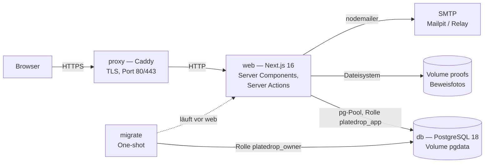
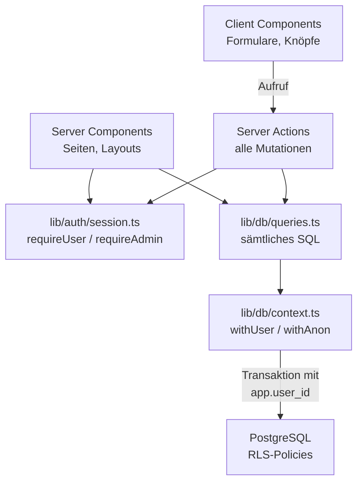
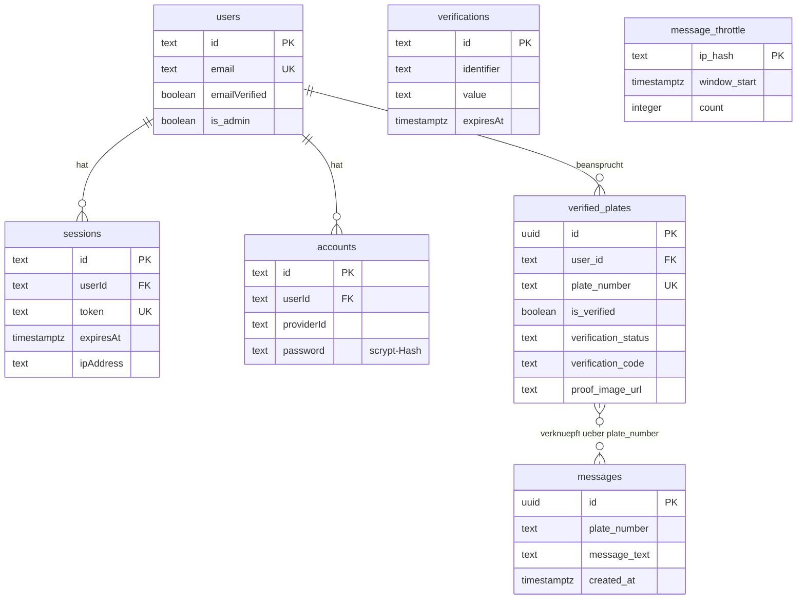
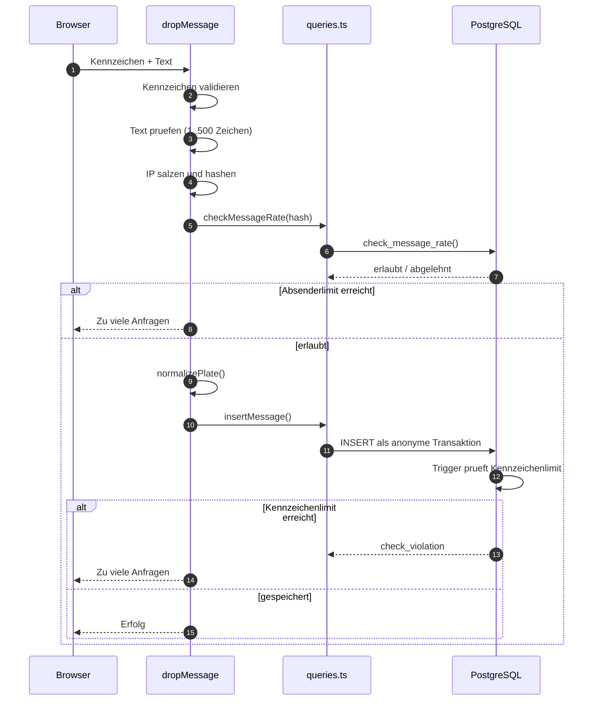
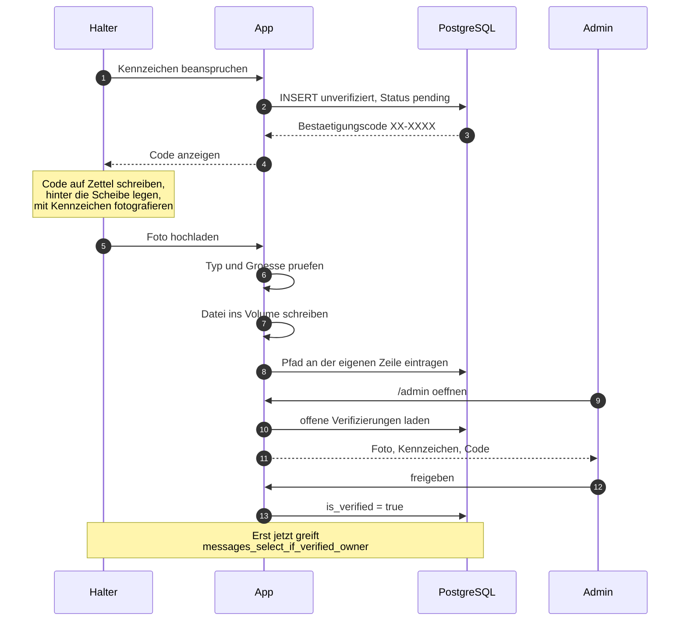
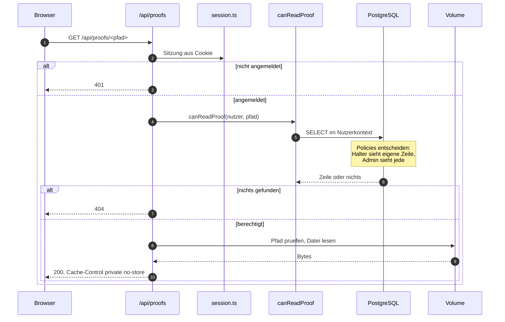
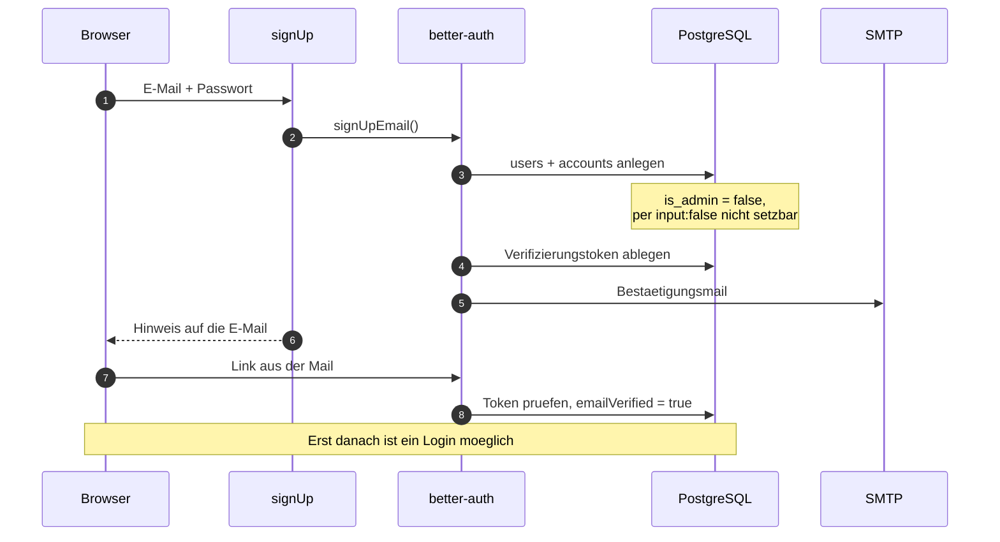

# Technische Dokumentation

PlateDrop ist eine Web-App, mit der sich anonym Nachrichten an deutsche Kennzeichen senden lassen.
Lesen darf sie nur, wer das Kennzeichen nachweislich besitzt. Diese Asymmetrie — **öffentlich
schreiben, authentifiziert lesen** — ist die zentrale Entwurfsvorgabe; nahezu jede Entscheidung im
System dient ihr.

Das Dokument beschreibt, wie das System aufgebaut ist und warum. Für den Betrieb siehe die
[Admin-Anleitung](admin.md).

---

## 1. Überblick

Die Anwendung läuft vollständig selbst betrieben. Es gibt keinen verwalteten Dienst: Datenbank,
Authentifizierung, Dateiablage und Mailversand liegen alle in eigenen Containern.



| Container | Aufgabe |
| --- | --- |
| `db` | PostgreSQL 18. Hält Nutzer, Sitzungen, Kennzeichen, Nachrichten und die Rate-Limit-Fenster. |
| `migrate` | Läuft einmal vor `web`, legt die App-Rolle an und spielt offene Migrationen ein. Beendet sich danach. |
| `web` | Die Anwendung. Rendert serverseitig, nimmt Mutationen über Server Actions entgegen. |
| `proxy` | Caddy, optional über das Compose-Profil `proxy`. TLS-Terminierung, holt Zertifikate selbst. |

`web` und `migrate` teilen sich dasselbe Image: Der standalone-Build von Next.js enthält bereits
`pg`, ein zweites Image wäre reiner Ballast.

---

## 2. Schichten und Verantwortungen



| Schicht | Verantwortung |
| --- | --- |
| Client Components | Nur Interaktion: Eingaben entgegennehmen, Zustand anzeigen. **Kein Datenbankzugriff.** |
| Server Components | Daten für die Darstellung laden, Zugang absichern. |
| Server Actions | Eingaben validieren, Mutationen ausführen. Der einzige Schreibweg. |
| `session.ts` | Wer fragt gerade, und darf er das? |
| `queries.ts` | Sämtliches SQL der Anwendung, gebündelt an einer Stelle. |
| `context.ts` | Öffnet die Transaktion und teilt der Datenbank die Identität des Anfragenden mit. |
| Policies | Setzen durch, welche Zeilen dabei überhaupt sichtbar sind. |

**Warum Client Components nicht an die Datenbank dürfen.** Unter Supabase sprachen sie über PostgREST
direkt mit der Datenbank; RLS war dabei die einzige Schranke. Ohne PostgREST gibt es diesen Weg
nicht mehr: Die Zugangsdaten zur Datenbank liegen ausschließlich serverseitig, und in Produktion ist
der Datenbank-Port überhaupt nicht nach außen exponiert. (In der Entwicklung mappt das Override
`localhost:5432` für Werkzeuge wie `psql` — für den Browser ändert das nichts, er hat keine
Zugangsdaten.) Daten kommen deshalb beim Rendern in die Seite, und interaktive Teile
sind kleine Client Components darunter.

---

## 3. Request-Wege

### Server Actions sind der einzige Weg für Mutationen

Nachricht senden, Kennzeichen beanspruchen, Foto hochladen, Freigabe erteilen, alle Auth-Formulare —
alles läuft über Server Actions. Für Schreibzugriffe gibt es bewusst **keine** API-Routen.

### Zwei Route Handler als bewusste Ausnahmen

| Route | Warum sie existiert |
| --- | --- |
| [`/api/auth/[...all]`](../src/app/api/auth/[...all]/route.ts) | better-auth braucht sie. Die Links in Bestätigungs- und Reset-Mails müssen auf eine URL zeigen, nicht auf eine Server Action. |
| [`/api/proofs/[...path]`](../src/app/api/proofs/[...path]/route.ts) | **Nur GET, verändert nichts.** Ein ``-Tag braucht eine URL. Prüft bei jedem Abruf Sitzung und Berechtigung neu. |

Die Regel „keine API-Routen" gilt für Mutationen. Beide Ausnahmen schreiben nichts.

### Routen der Anwendung

| Route | Beschreibung | Zugriff |
| --- | --- | --- |
| `/` | Anonyme Nachricht an ein Kennzeichen senden | öffentlich |
| `/login` | Anmeldung und Registrierung | öffentlich |
| `/forgot-password` | Passwort-Reset anfordern | öffentlich |
| `/reset-password` | Neues Passwort setzen, Token aus der E-Mail | öffentlich |
| `/dashboard` | Kennzeichen verwalten, Nachrichten lesen | angemeldet |
| `/dashboard/settings` | E-Mail und Passwort ändern | angemeldet |
| `/admin` | Offene Verifizierungen prüfen | angemeldet + Admin |
| `/impressum`, `/datenschutz` | Rechtliches | öffentlich |
| `/api/auth/[...all]` | better-auth-Endpunkte | öffentlich |
| `/api/proofs/[...path]` | Beweisfoto ausliefern | Halter oder Admin, pro Abruf geprüft |

### Kennzeichen-Normalisierung

Jedes Kennzeichen durchläuft vor jedem Datenbankzugriff `normalizePlate` aus
[`plateUtils.ts`](../src/lib/utils/plateUtils.ts): Bindestriche und Leerzeichen fallen weg, alles
wird großgeschrieben. Aus `KA-AB-1234` wird `KAAB1234`.

Das ist keine Kosmetik. Nachrichten und Kennzeichen werden über `plate_number` verknüpft — würden
Schreib- und Lesepfad unterschiedlich normalisieren, fände der Join in `listMessagesForUser` nichts
mehr, und Halter sähen ihre Nachrichten nicht.

---

## 4. Datenmodell



`messages` und `verified_plates` sind **nicht** über einen Fremdschlüssel verbunden, sondern nur über
den gemeinsamen Wert in `plate_number`. Das ist Absicht: Eine Nachricht existiert unabhängig davon,
ob das Kennzeichen jemals beansprucht wird, und sie trägt keinerlei Spur ihres Absenders.

### Tabellen von better-auth

Erzeugt aus der Konfiguration in [`server.ts`](../src/lib/auth/server.ts), festgehalten in
[`0002_auth.sql`](../db/migrations/0002_auth.sql). Die Spaltennamen stehen in camelCase und brauchen
in SQL doppelte Anführungszeichen.

| Tabelle | Inhalt |
| --- | --- |
| `users` | Konto: E-Mail, Bestätigungsstatus, Anzeigename, `is_admin` |
| `sessions` | Aktive Sitzungen mit Token, Ablauf, IP-Adresse und User-Agent |
| `accounts` | Zugangsverfahren; für E-Mail/Passwort steht hier der scrypt-Hash |
| `verifications` | Kurzlebige Token für Bestätigung, Reset und E-Mail-Wechsel |

`is_admin` ist ein Zusatzfeld auf `users`, deklariert als `input: false` — better-auth verwirft es
aus jedem Request-Payload. Eine eigene `profiles`-Tabelle wie unter Supabase gibt es nicht mehr.

### Fachtabellen

Definiert in [`0003_app_tables.sql`](../db/migrations/0003_app_tables.sql).

**`verified_plates`** — ein beanspruchtes Kennzeichen.

| Spalte | Bedeutung |
| --- | --- |
| `user_id` | Halter, `ON DELETE CASCADE` |
| `plate_number` | normalisiert, projektweit eindeutig |
| `is_verified` | Erst wenn `true`, sind Nachrichten lesbar |
| `verification_status` | `pending`, `approved` oder `rejected`, per CHECK erzwungen |
| `verification_code` | Code im Format `XX-XXXX`, den der Halter aufs Foto legt |
| `proof_image_url` | Objektpfad im Volume, nie eine öffentliche URL |

**`messages`** — eine anonyme Nachricht. Ein CHECK begrenzt den Text auf 1 bis 500 Zeichen und
spiegelt damit die Validierung der Server Action auf Datenbankebene.

**`message_throttle`** — das rollierende Fenster je Absender. Enthält nur den gesalzenen Hash, nie
eine IP-Adresse.

---

## 5. Sicherheitsmodell

Das Kernversprechen wird auf **zwei voneinander unabhängigen Ebenen** durchgesetzt. Für ein Leck
müssten beide gleichzeitig versagen.

### Ebene 1: Row Level Security

Unter Supabase setzte PostgREST die Policies durch. Ohne PostgREST verbindet sich die Anwendung mit
genau einer Rolle — RLS wäre wirkungslos, wenn diese Rolle zu viel dürfte. Drei Dinge verhindern das:

1. **Die App-Rolle ist schwach.** `platedrop_app` besitzt keine Tabelle, hat kein `BYPASSRLS`, ist
   kein Superuser und bekommt nur die nötigen Grants. Nur unter diesen Bedingungen greifen Policies
   überhaupt gegenüber der Anwendung.
2. **Die Identität kommt pro Transaktion.** `withUser()` in
   [`context.ts`](../src/lib/db/context.ts) öffnet eine Transaktion und setzt die Nutzer-ID als
   Session-Variable. Die Policies lesen sie über `app.current_user_id()`.
3. **Die Variable ist transaktionslokal.** `set_config(..., true)` bindet den Wert an die
   Transaktion. Mit COMMIT oder ROLLBACK verschwindet er und kann nicht an die nächste Anfrage
   durchsickern, die dieselbe Verbindung aus dem Pool erhält.

Punkt 3 ist der subtilste. Ein Integrationstest greift deshalb bewusst **am Kontext vorbei** direkt
auf den Pool zu und prüft, dass dort nichts zurückbleibt — eine Prüfung über `withAnon` würde ein
Durchsickern verdecken, weil sie die Variable selbst neu setzt.

### Die Policies im Einzelnen

Alle aus [`0004_policies.sql`](../db/migrations/0004_policies.sql).

**`verified_plates`**

| Policy | Wirkung |
| --- | --- |
| `verified_plates_select_own` | Ein Nutzer sieht nur Zeilen mit seiner eigenen `user_id`. Anonyme sehen nichts. |
| `verified_plates_select_admin` | Admins sehen alle Zeilen — Grundlage der Freigabe-Ansicht. |
| `verified_plates_insert_own` | Anlegen nur auf eigenen Namen **und** nur mit `is_verified = false` und Status `pending`. Ohne die letzten beiden Bedingungen könnte sich jemand beim Anlegen selbst freischalten. |
| `verified_plates_update_proof_only` | Ändern nur an eigenen Zeilen, und das Ergebnis muss weiterhin unverifiziert sein mit Status `pending` oder `rejected`. Praktisch bleibt damit nur das Nachreichen des Fotos. Anmerkung: Die Policy erlaubt das auch nach einer Ablehnung, die Oberfläche bietet es derzeit aber nicht an — siehe [Admin-Anleitung, A3](admin.md#eine-ablehnung-ist-derzeit-eine-sackgasse). |
| `verified_plates_update_admin` | Admins dürfen freigeben und ablehnen. |
| `verified_plates_delete_own` | Ein Nutzer darf eigene Kennzeichen entfernen. |

**`messages`**

| Policy | Wirkung |
| --- | --- |
| `messages_insert_public` | `WITH CHECK (true)` — jede Person darf schreiben, ohne Konto, ohne Login. Der Kern der App. |
| `messages_select_if_verified_owner` | Lesen nur, wenn eine Zeile in `verified_plates` existiert, die dem Anfragenden gehört, auf dasselbe Kennzeichen lautet **und** `is_verified = true` trägt. |
| `messages_no_update` / `messages_no_delete` | `USING (false)`. Zusätzlich fehlt der App-Rolle jedes UPDATE- und DELETE-Recht auf `messages`; der Versuch scheitert deshalb schon am Grant, bevor die Policy greift. Die Policies dokumentieren die Absicht und tragen, falls je ein Grant hinzukäme. |

### Warum die Auth-Tabellen ohne RLS laufen

Auf `users`, `sessions`, `accounts` und `verifications` ist RLS **nicht** aktiviert. Das ist Absicht:
better-auth muss Nutzer anlegen und Sitzungen prüfen, bevor überhaupt ein Nutzerkontext existiert —
bei der Registrierung und bei jedem Login gibt es noch keine `app.user_id`. Diese Tabellen erreicht
ausschließlich die Auth-Bibliothek; die Anwendung fasst sie nie direkt an.

`app.is_admin()` liest `users` als `SECURITY DEFINER`. So können die Policies das Admin-Flag prüfen,
ohne der App-Rolle dafür eigene Leserechte auf die Nutzertabelle zu geben.

### Ebene 2: Anwendungsschicht

Jede Funktion in [`queries.ts`](../src/lib/db/queries.ts) filtert **zusätzlich** explizit nach
`user_id`, obwohl die Policy das bereits täte. Admin-Server-Actions prüfen `isAdmin` aus der Session,
bevor sie die Datenbank überhaupt fragen. Geschützte Seiten rufen `requireUser()` oder
`requireAdmin()` auf.

Ein vergessener Filter allein führt damit zu keinem Leck, eine fehlerhafte Policy allein ebenso
wenig.

### Beweisfotos

Die Dateien liegen im Volume `proofs` unter `<nutzer-id>/<kennzeichen-id>-<zeitstempel>.<endung>`.

- **Der Pfad wird vor jedem Dateizugriff gegen ein striktes Muster geprüft** — zwei Segmente, UUID
  als Präfix, keine Punkte im Dateinamen außer der Endung. Ein `..` kommt dadurch gar nicht erst
  durch. Ein zweiter Test vergleicht zusätzlich den aufgelösten Pfad mit dem Wurzelverzeichnis.
- **Die Endung stammt aus dem Content-Type, nie aus dem übermittelten Dateinamen.** Der kommt vom
  Client und ist frei wählbar. SVG ist nicht erlaubt, weil es Skripte enthalten kann.
- **Autorisiert wird bei jedem Abruf.** Das ersetzt die früheren Signed URLs von Supabase: Statt
  einen Link zehn Minuten lang gültig zu halten, prüft der Route Handler jedes Mal neu. Wird ein
  Kennzeichen abgelehnt oder gelöscht, endet der Zugriff sofort.
- Ein unberechtigter Abruf liefert **404, nicht 403** — die Antwort verrät damit nicht, ob der Pfad
  existiert.

---

## 6. Rate-Limiting

Zwei unabhängige Ebenen, beide in [`0005_rate_limit.sql`](../db/migrations/0005_rate_limit.sql), und
beide ohne Klartext-IP.

| Ebene | Grenze | Mechanismus |
| --- | --- | --- |
| Je Absender | 10 Nachrichten pro Minute | Funktion `check_message_rate`, pflegt atomar ein rollierendes Fenster in `message_throttle` |
| Je Kennzeichen | 20 Nachrichten pro Stunde | Trigger `enforce_message_rate_limit` vor jedem INSERT |

**Warum zwei.** Das Absenderlimit bremst Massenversand von einer Stelle aus. Es lässt sich aber über
wechselnde IP-Adressen umgehen — deshalb der Deckel je Kennzeichen als Auffanglinie gegen gezieltes
Fluten einer einzelnen Person.

**Warum keine IP gespeichert wird.** Die Server Action bildet in
[`rateLimit.ts`](../src/lib/utils/rateLimit.ts) einen SHA-256-Hash aus IP, einem geheimen Salt und
dem aktuellen Datum. Nur dieser Hash erreicht die Datenbank. Die tägliche Rotation begrenzt, wie
lange sich Anfragen überhaupt korrelieren lassen. Lässt sich keine IP bestimmen, wird die Anfrage
durchgelassen — der Deckel je Kennzeichen greift dann als Auffanglinie.

Beide Funktionen sind `SECURITY DEFINER` mit festem `search_path`, und `message_throttle` hat weder
Policy noch Grant: An die Tabelle kommt nur die Funktion selbst heran.

---

## 7. Abläufe

### Anonyme Nachricht senden



### Kennzeichen verifizieren



### Beweisfoto abrufen



### Registrieren und bestätigen



---

## 8. Migrationen

Das Schema besteht aus nummerierten SQL-Dateien in [`db/migrations/`](../db/migrations/), angewandt
von [`scripts/migrate.mjs`](../scripts/migrate.mjs).

| Datei | Inhalt |
| --- | --- |
| `0001_roles_and_schema.sql` | Schema `app`, Funktion `app.current_user_id()`, Rechte der App-Rolle |
| `0002_auth.sql` | Tabellen von better-auth, erzeugt aus der Konfiguration |
| `0003_app_tables.sql` | `verified_plates`, `messages`, `message_throttle` |
| `0004_policies.sql` | RLS-Policies und Grants — das Sicherheitsmodell |
| `0005_rate_limit.sql` | Trigger und Funktion für beide Limits |

Der Runner verbindet sich als Owner, stellt zuerst die Rolle `platedrop_app` sicher und spielt dann
jede noch nicht vermerkte Datei **in einer eigenen Transaktion** ein. Was gelaufen ist, steht in
`schema_migrations`.

**Angewandte Dateien werden nie geändert.** Der Runner überspringt sie anhand des Dateinamens; eine
nachträgliche Änderung käme auf bestehenden Installationen nie an. Schemaänderungen kommen immer als
neue, höher nummerierte Datei.

Das Auth-Schema in `0002` lässt sich bei einem better-auth-Upgrade mit
[`scripts/generate-auth-schema.mjs`](../scripts/generate-auth-schema.mjs) neu erzeugen — gegen eine
leere Datenbank, sonst enthält der Plan nur die Differenz zum Ist-Zustand.

---

## 9. Teststrategie

Drei Ebenen mit unterschiedlichem Zuschnitt.

| Ebene | Befehl | Deckt ab |
| --- | --- | --- |
| Unit | `pnpm test` | Kennzeichenlogik, Claim-Formular, Pfadprüfung der Beweisfotos. Braucht kein Docker. |
| Integration | `pnpm test:db:up && pnpm test:integration` | Policies, Data-Access-Modul, Transaktionskontext, Migrations-Runner, Admin-Skript, Mailversand, die öffentliche Server Action. Läuft gegen echtes Postgres und Mailpit. |
| End-to-End | `pnpm smoke` | Der vollständige Ablauf über HTTP gegen den laufenden Stack: Registrierung, Bestätigungsmail, Login, geschützte Seiten, Auslieferung der Beweisfotos, Passwort-Reset. |

Die wichtigste Datei ist [`__tests__/integration/rls.test.ts`](../__tests__/integration/rls.test.ts).
Sie prüft die Kernzusagen direkt gegen die Policies: anonym schreiben aber nicht lesen, keine fremden
Nachrichten, nichts vor der Freigabe, kein Selbst-Freischalten, kein Admin-Zugriff ohne Admin-Recht.

**Diese Tests wurden gegengeprüft, indem die jeweilige Policy absichtlich kaputt gemacht und der
Testlauf beobachtet wurde** — RLS abschalten, `app.is_admin()` auf `true` festnageln, den
Eigentümerfilter entfernen. Jede Mutation wurde erkannt. Zwei Tests fielen bei dieser Prüfung durch
und mussten ersetzt werden, weil sie das behauptete Verhalten gar nicht messen konnten.

Wer eine Policy ändert, führt diese Suite aus. Und schreibt den Test zuerst.

---

## 10. Verzeichnisstruktur

```
db/migrations/          Schema, Policies und Rate-Limits als nummerierte SQL-Dateien
scripts/                Migrations-Runner, Admin-Skript, Rauchtest, Auth-Schema-Generator
src/app/                Routen; jede actions.ts enthaelt die Server Actions ihres Bereichs
src/app/api/            Die zwei bewussten Route Handler
src/components/         features/ fuer fachliche Formulare, ui/ fuer Rahmenelemente
src/lib/auth/           better-auth-Konfiguration und Session-Helfer
src/lib/db/             Pool, Transaktionskontext, saemtliches SQL, Zeilentypen
src/lib/email/          Mailversand und Vorlagen
src/lib/storage/        Ablage und Lesen der Beweisfotos
src/lib/utils/          Kennzeichenlogik, pseudonymisiertes IP-Hashing
__tests__/              unit (utils, components, lib) und integration/
```

Die Dateien, die man zuerst lesen sollte:

- [`src/lib/db/context.ts`](../src/lib/db/context.ts) — hier entsteht der Nutzerkontext für RLS
- [`src/lib/db/queries.ts`](../src/lib/db/queries.ts) — sämtliches SQL der Anwendung
- [`db/migrations/0004_policies.sql`](../db/migrations/0004_policies.sql) — das Sicherheitsmodell
- [`src/lib/auth/server.ts`](../src/lib/auth/server.ts) — wie Auth konfiguriert ist
